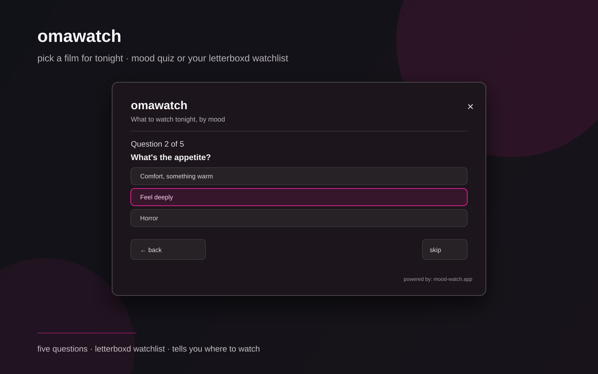

# omawatch

[Español](README.es.md)




## Real screenshots

These are captures from the running plugin on an Omarchy desktop, not mockups:

- [home](screenshots/01-home-final.png) — mood test, Letterboxd and surprise actions.
- [quiz](screenshots/02-quiz-final.png) — five-question mood flow.
- [Letterboxd](screenshots/03-letterboxd-final.png) — public watchlist connection.
- [results](screenshots/04-results-final.png) — three live recommendations from mood-watch.app.
- [desktop bar](screenshots/05-desktop-bar.png) — the real bar context with the film icon.

The small film-reel icon in `icon.svg` is also used by the bar widget.

A bilingual Omarchy / Quickshell panel that picks a film for tonight. Answer a five-question mood quiz — or connect your Letterboxd username and get picks from your own watchlist. Powered by [mood-watch.app](https://mood-watch.app).

It is deliberately not a tracker or a social feed. It answers one question: what do I watch tonight?

## What it does

- **Quick mood test** — five questions (energy, appetite, time, tone, aftertaste) and it returns three picks with poster, year, director, runtime and overview.
- **Letterboxd watchlist** — enter your username once, it reads your public watchlist, and the same quiz then picks from *your* list. The public `@callmeout` account was used for the real screenshot/e2e check (466 watchlist titles).
- **Surprise me** — no questions, a random wager from the catalog.
- Picks include "where to watch" and Letterboxd links.
- Bilingual UI (English/Spanish) following the system locale.
- The username is only used to read your public watchlist. Nothing is stored on disk and no account is created.

## Install

```bash
omarchy plugin add https://github.com/brm-src/omawatch.git --enable --yes
```

No administrator privileges are required. The plugin needs Omarchy/Hyprland, Quickshell, Python 3, and an internet connection.

## Use

1. Click the film icon in the bar.
2. Choose **quick mood test**, **use my letterboxd watchlist**, or **surprise me**.
3. For Letterboxd: type your username, wait for the sync, then answer the quiz.
4. Read the three picks, open "where to watch ↗" or Letterboxd if one calls you.

Press `Escape`, `Super + W`, or click outside the card to close.

## How it works

1. `Omawatch.qml` renders the panel and the quiz, following the Omarchy design system (same fonts, colors, borders and spacing as the built-in panels).
2. `omawatch.py` is a stateless helper: each action is one subprocess call that talks to the public mood-watch API over HTTPS.
3. Mood answers map to the same scoring axes the web app uses (energy, risk, tone, trust, depth, runtime, company).
4. Watchlist sync uses the public sync flow: start, poll until ready, then request picks restricted to the watchlist with the returned token. The token lives only in memory.

## Privacy

- No text, username, or watchlist data is written to disk.
- Only the public Letterboxd watchlist is read; no login, no password, no API keys.
- Requests go to `moodwatch-api.brmcl.workers.dev` (Cloudflare). See the [mood-watch privacy notes](https://mood-watch.app).

## Remove

```bash
omarchy plugin remove io.github.brm-src.omawatch --yes
```

Or disable it first:

```bash
omarchy plugin disable io.github.brm-src.omawatch
```

## Development checks

Run from the repository root:

```bash
python3 -m unittest discover -s tests -v
python3 -m py_compile omawatch.py
qmllint -I /usr/share/omarchy/shell BarButton.qml Omawatch.qml
omarchy plugin validate .
```

## License

MIT. See [LICENSE](LICENSE).
