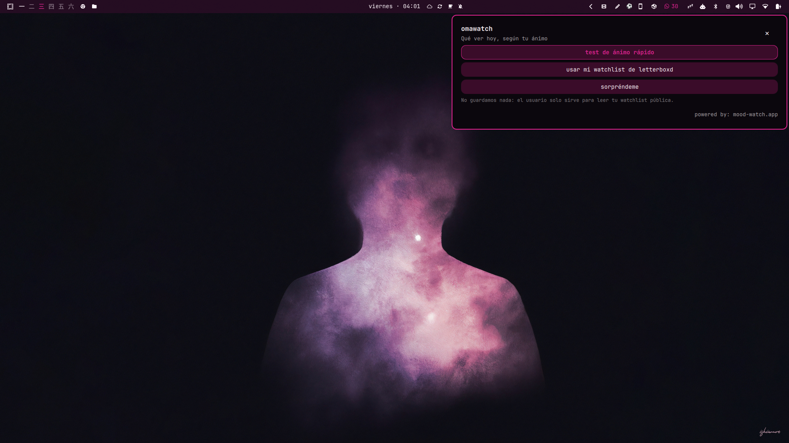
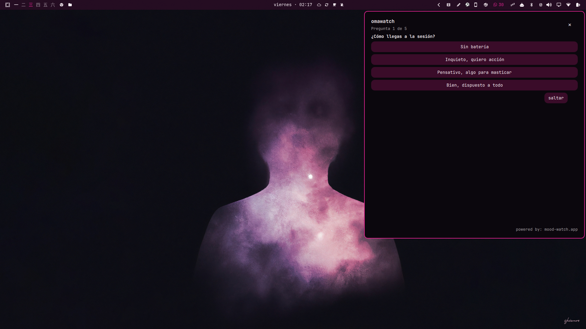
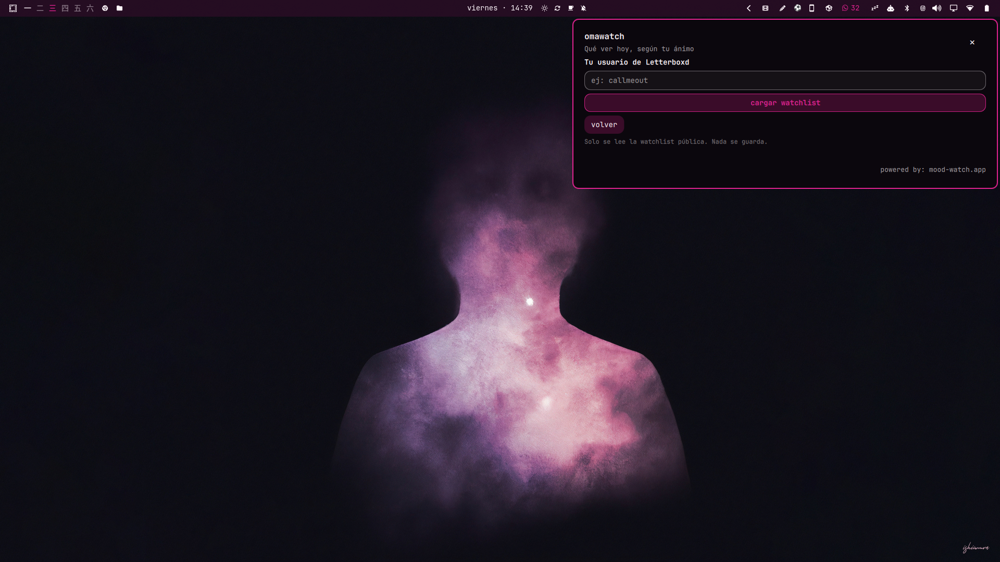
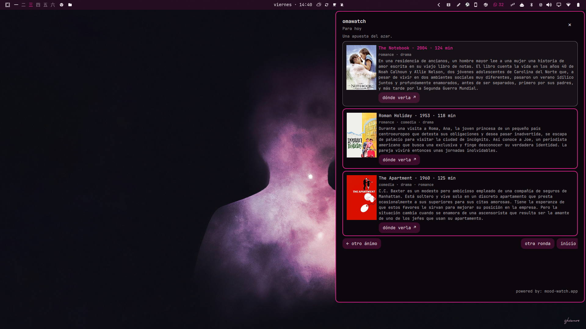
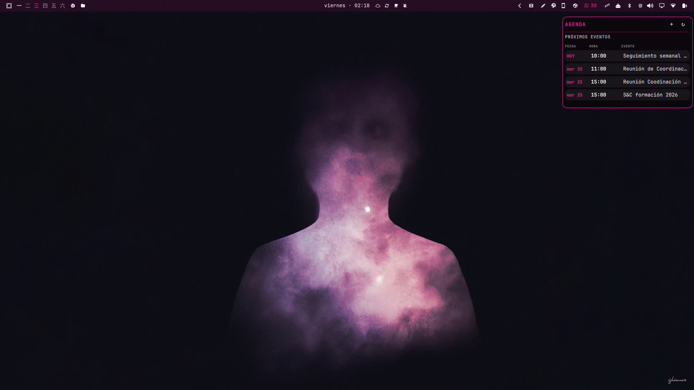

# omawatch

<p align="center">
  <a href="https://www.ko-fi.com/brmcl"></a>
</p>

<p align="center">
  <strong>A small, opinionated film picker for Omarchy.</strong><br />
  Five mood questions, a public Letterboxd watchlist, or one blind wager for tonight.
</p>

<p align="center">
  <a href="https://github.com/brm-src/omawatch/releases"></a>
  <a href="https://github.com/brm-src/omawatch/blob/main/LICENSE"></a>
</p>

<p align="center">
  
</p>

A bilingual Omarchy / Quickshell panel powered by [mood-watch.app](https://mood-watch.app). It answers one question without becoming a tracker, social feed, or recommendation dashboard:

> **What should I watch tonight?**

## Real screenshots

These are captures from the running plugin on an Omarchy desktop, not mockups.

<p align="center">
  
</p>

<p align="center"><em>Home: mood test, surprise pick, public Letterboxd watchlist.</em></p>

<p align="center">
  
</p>

<p align="center"><em>Quiz: short, focused questions with compact controls.</em></p>

<p align="center">
  
</p>

<p align="center"><em>Letterboxd: public watchlist connection, no login or password.</em></p>

<p align="center">
  
</p>

<p align="center"><em>Results: live posters, complete overviews, English presentation titles where appropriate, and localized descriptions.</em></p>

<p align="center">
  
</p>

<p align="center"><em>The real bar context with the film icon.</em></p>

## What it does

- **Quick mood test** — five questions covering energy, appetite, time, tone, and aftertaste.
- **Letterboxd watchlist** — enter a public username and pick only from your own watchlist. The public `@callmeout` account was used for the real sync check with 466 titles.
- **Surprise me** — one curated blind pick without a questionnaire.
- **Useful film cards** — poster, title, year, director, runtime, complete overview, where-to-watch link, and Letterboxd link.
- **Presentation rule** — titles and posters stay in English unless the film is Spanish-language; overviews and genres follow the system language.
- **Bilingual UI** — English or Spanish according to the system locale.
- **Privacy by default** — no account, no password, no API key, and no watchlist data written to disk.

## Install

```bash
omarchy plugin add https://github.com/brm-src/omawatch.git --enable --yes
```

No administrator privileges are required. The plugin needs Omarchy / Hyprland, Quickshell, Python 3, and an internet connection.

## Use

1. Click the film icon in the Omarchy bar.
2. Choose **Quick mood test**, **Connect watchlist**, or **Surprise me**.
3. For Letterboxd, enter a public username, wait for the sync, and answer the quiz.
4. Read the picks and open **where to watch** or **Letterboxd** when useful.

Press `Escape`, `Super + W`, or click outside the panel to close it.

## How it works

1. `Omawatch.qml` renders the panel using Omarchy's own primitives, fonts, colors, borders, separators, action rows, and compact controls.
2. `omawatch.py` is a stateless HTTPS helper for the public mood-watch API.
3. Anonymous answers are mapped to the same editorial routes used by the web product.
4. Spanish presentation fetches the English title/poster variant in parallel while keeping the overview in Spanish.
5. Letterboxd sync starts and polls a public read-only job; its short-lived token stays in memory only.

## Privacy

- No text, username, or watchlist data is written to disk.
- Only a public Letterboxd watchlist is read; there is no login flow.
- Requests go to `moodwatch-api.brmcl.workers.dev` through HTTPS.
- See the [mood-watch privacy notes](https://mood-watch.app).

## Remove

```bash
omarchy plugin remove io.github.brm-src.omawatch --yes
```

Or disable it first:

```bash
omarchy plugin disable io.github.brm-src.omawatch
```

## Development checks

Run from the repository root:

```bash
python3 -m unittest discover -s tests -v
python3 -m py_compile omawatch.py
qmllint -I /usr/share/omarchy/shell BarButton.qml Omawatch.qml
omarchy plugin validate .
```

## License

MIT. See [LICENSE](LICENSE).

<p align="center">
  <a href="https://www.ko-fi.com/brmcl"></a>
</p>
